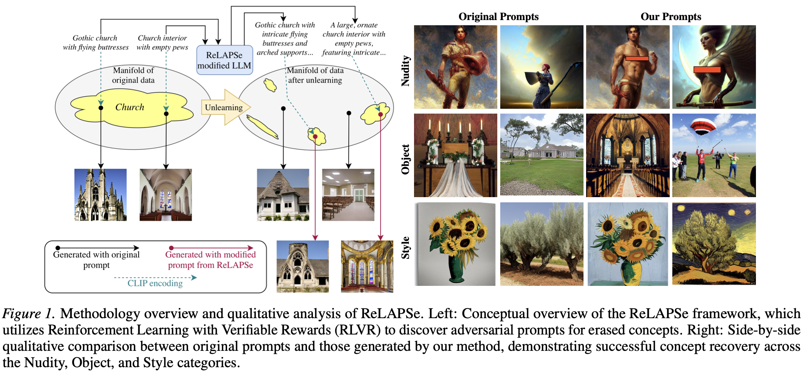

<div align="center"> 

# ReLaPSe: Reinforcement-Learning-trained Adversarial Prompt Search for Erased concepts in unlearned diffusion models 

</div>

<p align="center">
  <a href="https://www.arxiv.org/abs/2602.00350"></a>
</p>


<p align="center">
<b>Abstract</b>
</p>

<p align="justify">
Machine unlearning is a key defense mechanism for removing unauthorized concepts from text-to-image diffusion models, yet recent evidence shows that latent visual information often persists after unlearning. Existing adversarial approaches for exploiting this leakage are constrained by fundamental limitations: optimization-based methods are computationally expensive due to per-instance iterative search. At the same time, reasoning-based and heuristic techniques lack direct feedback from the target model’s latent visual representations. To address these challenges, we introduce <b>ReLaPSe</b>, a policy-based adversarial framework that reformulates concept restoration as a reinforcement learning problem. ReLaPSe trains an agent using Reinforcement Learning with Verifiable Rewards (RLVR), leveraging the diffusion model’s noise prediction loss as a model-intrinsic and verifiable feedback signal. This closed-loop design directly aligns textual prompt manipulation with latent visual residuals, enabling the agent to learn transferable restoration strategies rather than optimizing isolated prompts. By pioneering the shift from per-instance optimization to global policy learning, ReLaPSe achieves efficient, near-real-time recovery of fine-grained identities and styles across multiple state-of-the-art unlearning methods, providing a scalable tool for rigorous red-teaming of unlearned diffusion models. Some experimental evaluations involve sensitive visual concepts, such as nudity.

</p>


<p align="center">
  
</p>

This repository includes a modified version of ms-swift (originally from ModelScope), 
a framework for efficient training and experimentation with large language models (LLMs).
The original project is available at: https://github.com/modelscope/ms-swift

This repository provides:
* Implementation of ReLaPSe
* Training scripts for adversarial prompt policies
* Evaluation tools for measuring concept restoration

## Environment Preparation
```
git clone git@github.com:gmum/ReLaPSe.git
cd ReLaPSe

conda create -y --name relapse python=3.10.12
conda activate relapse

conda install -y cuda-toolkit=12.8 -c nvidia/label/cuda-12.8.0

pip install torch==2.7.1+cu128 torchvision==0.22.1 torchaudio==2.7.1  --index-url https://download.pytorch.org/whl/cu128

pip install -e ./ms_swift -U
pip install -r requirements.txt 
```

## Running instructions 

#### Download checkpoints [(Google Drive)](https://drive.google.com/drive/folders/1QZ-zUgFrNNXs1EycpujKVJIRYl-4MkMF)
We used checkpoints from AdvUnlearn repo (https://github.com/OPTML-Group/AdvUnlearn) - download and unzip them in files/models folder

#### Generate dataset (for unlearning robustness evaluation)
```python generate_dataset_imgs.py --prompts_path prompts/nudity.csv --concept i2p_nude --save_path files/datasets/nudity/```

#### Single object dataset:
``` python prepare_dataset.py --csv_path prompts/nudity.csv --image_dir files/datasets/nudity/i2p_nude/imgs --output_file files/datasets/nudity/single```

#### Full dataset:
``` python prepare_dataset.py --csv_path prompts/nudity.csv --image_dir files/datasets/nudity/i2p_nude/imgs --output_file files/datasets/nudity/full --full_data```

#### Run training:
##### Single dataset:
``` bash run_training_single.sh ```
##### Full dataset:
``` bash run_training_full.sh ```

## Metrics
```
python validate.py \
TODO
  ``` 

# Citation
```
@article{kolton2026relapse,
  title={ReLAPSe: Reinforcement-Learning-trained Adversarial Prompt Search for Erased concepts in unlearned diffusion models},
  author={Kolton, Ignacy and Marzol, Kacper and Batorski, Pawe{\l} and Mazur, Marcin and Swoboda, Paul and Spurek, Przemys{\l}aw},
  journal={arXiv preprint arXiv:2602.00350},
  year={2026}
}
```